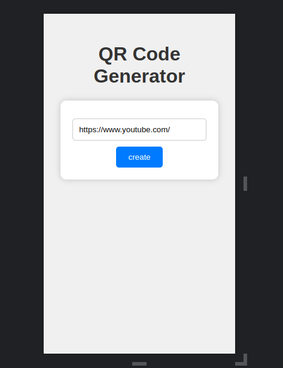
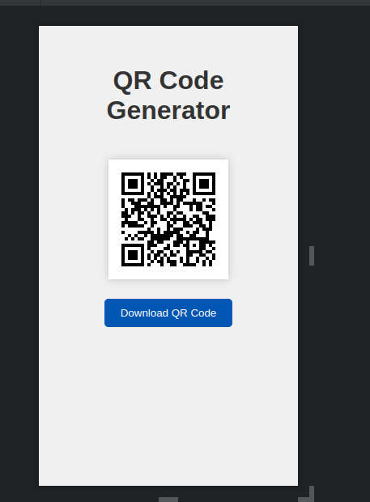

# qr-code-generator

Este repositorio contiene una aplicación Node.js que te permite generar códigos QR personalizados con enlaces URL.
La aplicación es fácil de usar y proporciona una forma sencilla de crear códigos QR para cualquier enlace web que desees compartir.

## Características principales

- Genera códigos QR a partir de enlaces URL.
- Exporta los códigos QR generados en varios formatos de imagen.
- Integración sencilla en aplicaciones web y proyectos de Node.js.

## Instalación

Para ejecutar este proyecto en tu máquina local, sigue estos pasos:

1. Clona este repositorio en tu máquina local.

```bash
git clone https://github.com/yisusAbet24/qr-code-generator.git
```

2. Instala las dependencias

```bash
npm install
```

## Uso



